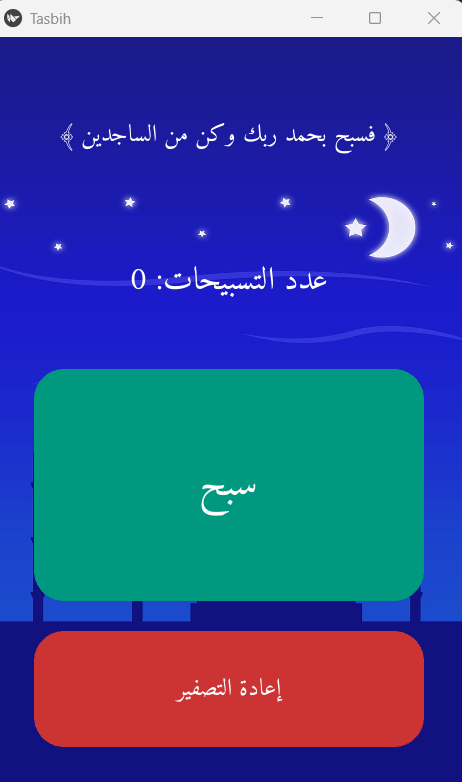

# TasbihApp
📿 A simple Tasbih counter app built with Python and Kivy, with Arabic support and a clean interface.
# 📿 Tasbih Counter App

A simple and elegant Islamic Tasbih app built with Python and the Kivy framework. Designed to help you keep track of your dhikr (remembrance of Allah) with support for Arabic text rendering and a clean, spiritual user interface.

---

## ✨ Features

- ✅ Beautiful and responsive UI
- 📖 Displays a Quranic verse for motivation
- 🧮 Real-time tasbih counter
- 🔄 Reset button
- 🔤 Full Arabic support using `arabic_reshaper` and `python-bidi`
- 🎨 Rounded custom buttons
- 💰 AdMob integration for monetization (can be customized)

---

## 🖼️ Screenshots

Here’s how the app looks:



## 🚀 Getting Started

### 1. Install dependencies:
```bash
pip install kivy kivmob arabic_reshaper python-bidi
```
### 2. Run the App:
```bash
python main.py
```
## 📱 Building for Android (optional):
```bash
buildozer init
```
### Update the buildozer.spec file:
```bash
requirements = python3,kivy,kivmob,arabic_reshaper,python-bidi
android.permissions = INTERNET, ACCESS_NETWORK_STATE
```
### Then build:
```bash
buildozer -v android debug
```
## 🧰 Tech Stack
* Python 3

* Kivy

* Arabic Reshaper

* Python-Bidi

* KivMob (AdMob wrapper)
  
## 📁 Project Structure

├── main.py              # Main application code
├── background.jpg       # Background image
├── Amiri.ttf            # Arabic font
└── README.md            # Project description

## 📌 Notes
Replace the AdMob App ID and Banner Unit ID with your own.

Ensure that Amiri.ttf and background.jpg are present in the project directory.

## 🤝 Contributions
Contributions, suggestions, and improvements are welcome!
## 📄 License
This project is licensed under the MIT License.

## 🙏 May Allah reward you for every tasbih.
Made with ❤️ by Ayyoub


